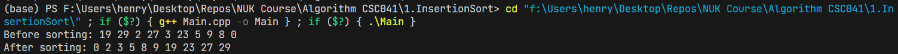

# Insertion Sort A1105534 張宏宇

## 1. 介紹

插入排序法（Insertion Sort）是一種簡單直觀的排序演算法。它的工作原理是通過構建有序序列，對於未排序資料，在已排序序列中從後向前掃描，找到相應位置並插入。  


## 2. 步驟

1. 從第一個元素開始，該元素可以認為已經被排序
2. 取出下一個元素，在已經排序的元素序列中從後往前掃描 ←
3. 如果該元素（已排序）大於新元素，將該元素移到下一位置
4. 重複步驟 3，直到找到已排序的元素小於或者等於新元素的位置
5. 將新元素插入到該位置後
6. 重複步驟 2~5

## 3. 程式碼

```cpp
class InsertionSort {
   public:
    static void sort(vector<int>& nums) {
        for (int i = 1; i < nums.size(); i++) {
            int j = i - 1;
            int key = nums[i];
            while (j >= 0 && nums[j] > key) {
                nums[j + 1] = nums[j];
                j--;
            }
            nums[j + 1] = key;
        }
    }
};
```

## 4. 執行結果

```
> g++ Main.cpp -o Main ; .\Main
Before sorting: 19 29 2 27 3 23 5 9 8 0
After sorting: 0 2 3 5 8 9 19 23 27 29
```



## 5. Analysis

已知 $d_j$ 為第 j 個元素左邊比他大的元素個數  

#### Best case | **O(n)**

當資料已經是由**小到大排序好**的狀況下，每一回合只需要比較 1 次，共需要比較 n-1 回合。  
$d_j = 0 $  
Data Movement  
$= 2(n-1) + \Sigma_{j=2}^{n} d_j$  
$= 2(n-1) + 0$  
時間複雜度為**O(n)**。  

#### Worst case | **O(n^2)**

當資料是由大到小排序好的狀況下，第 j 回合需要比 j-1 次  
$d_j = n-1 $  
需要比較 $\Sigma_{j=2}^{n}  d_j = \frac{n(n-1)}{2}$ 次。  
Data Movement  
$= 2(n-1) + \Sigma_{j=2}^{n} d_j$  
$= 2(n-1) + \frac{n(n-1)}{2}$  
時間複雜度為**O(n^2)**。  

#### Average case | **O(n^2)**

| Cases      | $d_j$         |
| ---------- | ------------- |
| x_j 最大   | $d_j$ = 0     |
| x_j 第二大 | $d_j$ = 1     |
| …          | …             |
| x_j 第二小 | $d_j$ = j - 2 |
| x_j 最小   | $d_j$ = j - 1 |

**假設每一個 Case 都有相同的機率 $\frac1 j$**
算出$d_j$的平均值  
$\frac{1}{j} {(0+1+...+(j-1))} = \frac{j-1}{2}$  
Data Movement  
$= 2(n-1) + {\Sigma_{j=2}^{n}} d_j$  
$= 2(n-1) + {\Sigma_{j=2}^{n}} (\frac{j-1}{2})$  
$= 2(n-1) + \frac{1}{2} {\Sigma_{j=2}^{n}} (j-1)$  
$= 2(n-1) + \frac{1}{2} (\frac{n(n-1)}{2})$  

時間複雜度為**O(n^2)**。  
