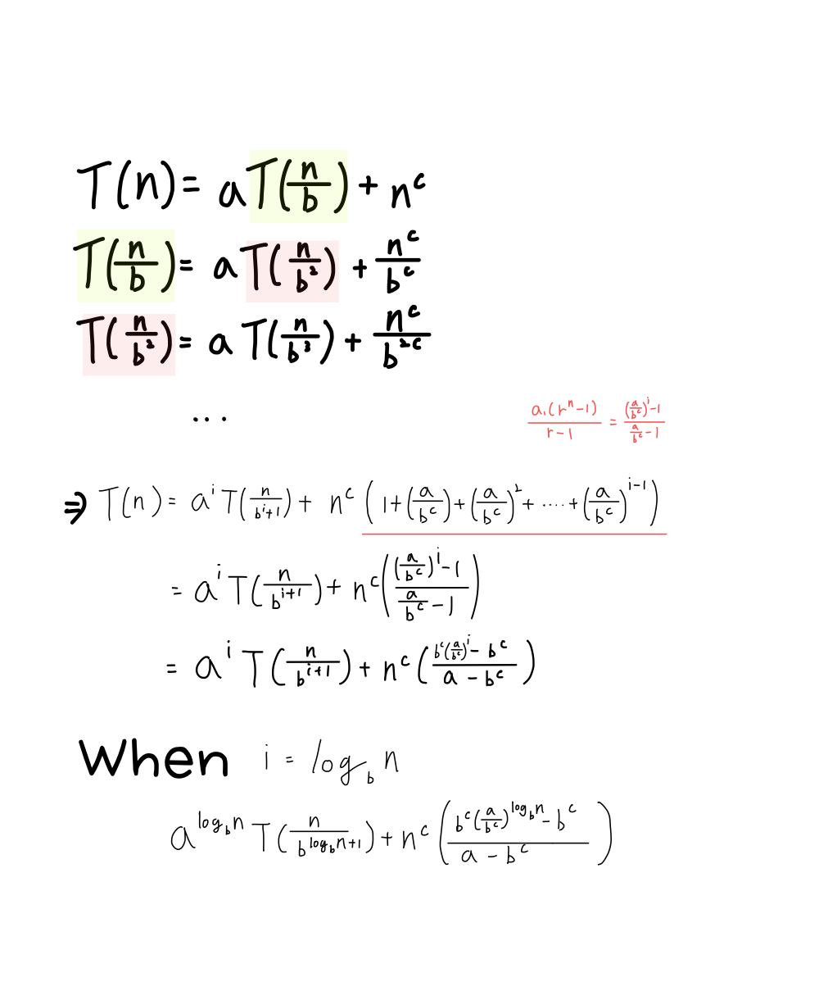
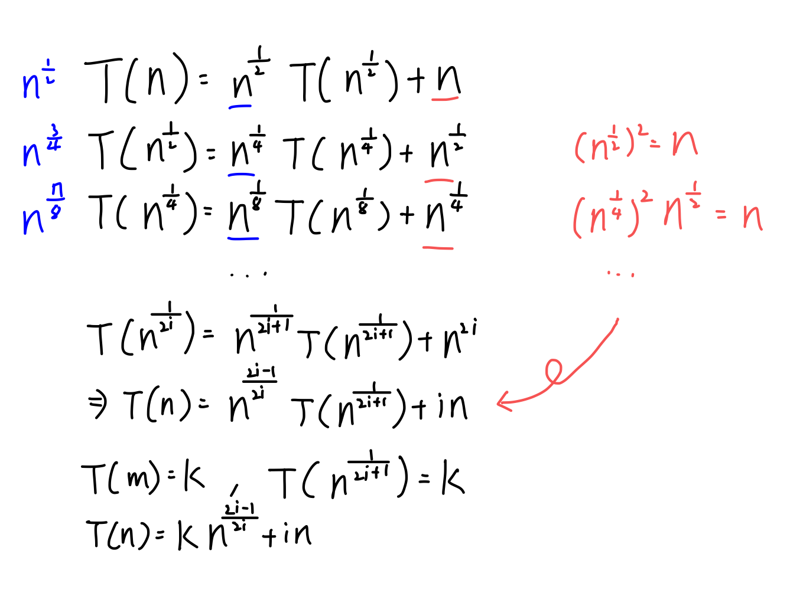

# Chapter 2-11

#### **2.7**

Show that if $T(n) = aT(\frac{n}{b})+n^c$, then for $n$ power of $b$ and $T(1)=k, T(n)=ka^{log_bn}+n^c(\frac{b^c}{a-b^c}((\frac{a}{b^c})^{log_bn})-1)$  

#### **2.8**

Show that if $T(n)=\sqrt{n}T(\sqrt{n})+n, T(m)=k$ and $2^i\sqrt{n} \leq m$, then $T(n) = kn^{(2^i-1)/2^i}+in$ .  

#### **2.10**

Show that binary search is optimal for all searching algorithms performing comparisons only.

#### **2.11**
Given the following pairs of functions, what is the smallest value of $n$ such that first function is larger than the second one.
 * (a) $2^n$,$2n^2$
 * (b) $n^{1.5}$,$2nlog_2n$
 * (c) $n^3$,$5n^{2.81}$

#### **2.12**
Is $\Omega(nlogn)$ time a lower bound forthe problem of sorting $n$ intergers ranged from 1 to C, where C is a constant? Why?
